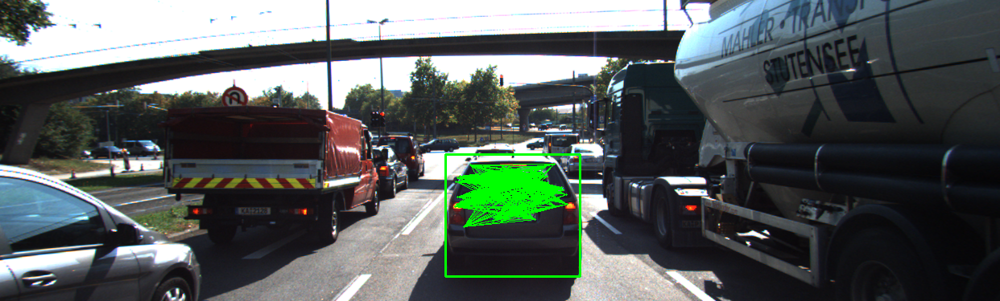
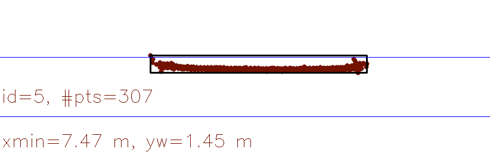
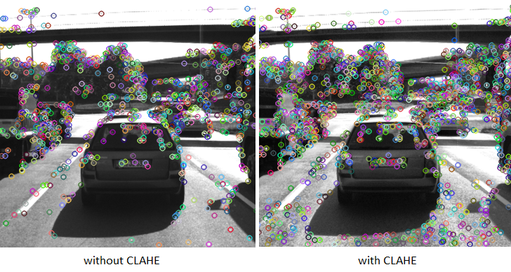
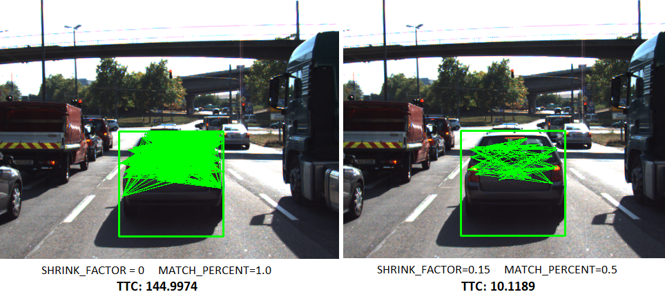
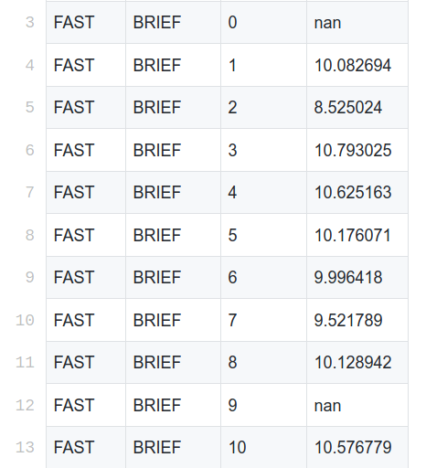

# TIME TO COLLISION - PERFORMANCE EVALUATION

This section will examine various cases where the result of Lidar TTC or Camera TTC does not seem plausible. Before diving into those cases, here is an overview of the TTC calculation process:
- Lidar TTC: calculate TTC based on the closest lidar point to the vehicle in current frame and the previous frame. Only point cloud data that is within ego lane and in front of the vehicle will be processed. Formula `TTC = curr_minX * dT / (prev_minX - curr_minX)`.
- Camera TTC: calculate TTC based on the change in relative distance ratio between keypoints on the vehicle. Formula `TTC = -dT / (1 - DistRatio)`. As the vehicle approaching ego, the relative distances between keypoint features will increase as a result of image perspective. Here is the pipeline for calculating Camera TTC:
  + Convert image to grayscale & Apply CLAHE to enhance the contrast of image
  + Using OpenCV Detector & Descriptor to find keypoints and their descriptors
  + Match keypoints from the current & previous images with OpenCV Matcher. Only a subset of matched keypoints that has the smallest distance will be kept.
  + Calculate the relative distance between the remaining matched keypoints.
  + Calculate distance ratios between matched keypoints from current and previous frame
  + Calculate TTC

## LIDAR TTC:
Lidar TTC was calculated in each frame and recorded in `ttc_lidar.csv`. The table below shows only frames where lidar TTC does not seem right.

| Frame ID | LIDAR TTC | Current Xmin | Previous Xmin | Previous LIDAR TTC |
|----------|-----------|--------------|---------------|--------------------|
| 7        | 34.3404   | 7.55         | 7.58          | 12.4213            |
| 11       | 3.3824    | 7.20         | 7.39          | 18.0318            |
| 12       | -10.8537  | 7.27         | 7.20          | 3.3824             |
| 17       | -9.9942   | 6.90         | 6.83          | 3.1754             |

In frame 7 & 11, there were sudden changes in TTC value with respect to the TTC in the previous frame. In frame 12 & 17, TTC value became negative while the results from previous and following frames were positive. Since we only use the closest lidar point from the vehicle to ego, TTC value is susceptible to noises. The single point cloud that we use can also be an invalid point, which comes from wrong measurement due to the effect of poor reflectivity or light interference. Instead of relying on a single point cloud, it is more reliable to calculate TTC based on the a group of closest point cloud, using median.

In the top-down view of point cloud above, we can see that minX corresponds to an outlier point on the right side the vehicle. This can potentially give us a wrong TTC result.

## CAMERA TTC:
There are several reasons why Camera TTC could be incorrect:
- *Not enough keypoint matches in ROI region*: more keypoint matches available inside the ROI does not necessarily give us a more reliable TTC result. However, with more keypoint matches, our model will be less susceptible to outliers and noises. To increase the number of keypoints on the vehicle, I apply Contrast Limited Adaptive Histogram Equalization (CLAHE) to each image to enhance the contrast (especially in dark region) before running the detector. To prevent outliers when finding matching keypoints for ROI, I use `UPPER_DISTANCE_LIMIT` parameter as a way to avoid keypoints that displace drastically between frame.

- *Poor-quality keypoint matches*: there could be inaccurate matches due to image quality or the appearance of parts from another vehicle in our ROI region. To address this issue, I added two new parameters: `SHRINK_FACTOR` to limit the region to accept keypoint matches, and `MATCH_PERCENTAGE` to throw away poor-quality matches.

- *The distribution of keypoint matches*: as we use the relative distance ratio between matched keypoints to calculate TTC, we should only accept distances that are within a certain range. This is because small distances are susceptible to noises, while large distances are limited by the distribution of keypoints on the vehicle. Nevertheless, changes between 10ms frames could be trivial for keypoints with large distances. For now, camera TTC will only accept distances ranging from 80 to 120 pixels.

- *Issue with image perspective*: the growth rate of relative distances between keypoints are not always uniform. Distances between far-away keypoints will growth at a slower rate than distances between closer keypoints (w.r.t ego vechile).

## TESTING WITH DIFFERENT DETECTOR & DESCRIPTOR COMBINATIONS:
TTC results for each detector & descriptor combination are collected and written to a csv file  `result/ttc_camera.csv` using `benchmark_camera_ttc.cpp`. Apart from the obvious NAN result in frame 0, other NAN results are due to either because we could not find any relative distances that are within MIN_DISTANCE & MAX_DISTANCE range, or because the vehicle does not get any closer to our ego vehicle compared to the previous frame (resulting in a distance ratio very close to 1).

