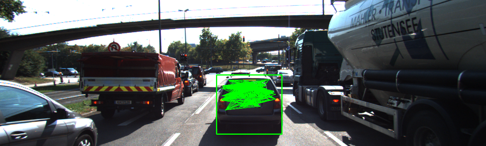

# TIME TO COLLISION - PERFORMANCE EVALUATION
This section will examine various cases where the result of Lidar TTC or Camera TTC does not seem plausible. Before diving into those cases, here is an overview of the TTC calculation process:
- Lidar TTC: calculate TTC based on the closest lidar point to the vehicle in current frame and the previous frame. Only point cloud data that is within ego lane and in front of the vehicle will be processed. Formula `TTC = curr_minX * dT / (prev_minX - curr_minX)`
- Camera TTC: calculate TTC based on the change in relative distance ratio between keypoints on the vehicle. As the vehicle approaching ego, the relative distances between keypoint features will increase as a result of image perspective. Formula `TTC = -dT / (1 - DistRatio)`. Here is the pipeline for calculating Camera TTC:
  + Convert image to grayscale
  + Apply CLAHE to enhance the contrast of image
  + Using OpenCV Detector & Descriptor to find keypoints and their descriptors
  + Match keypoints from the current & previous images
  + Keep only a subset of matched keypoints that has the best scores
  + Calculate the relative distance between the remaining matched keypoints.
  + Calculate distance ratios between matched keypoints from current and previous frame
  + Calculate TTC

